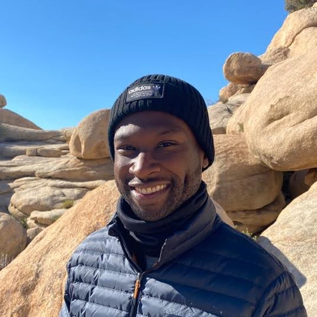

I am a Senior Software Engineer at Netflix working in the Studio Engineering
org. I've previously worked at VMware and Pivotal focusing on release
engineering of proprietary distributions of Cloud Foundry and Kubernetes,
infrastructure automation, and container networking.

[LinkedIn](https://www.linkedin.com/in/kevin-kelani-08b780177/) / [@kevinkelani on Twitter](https://www.twitter.com/kevinkelani)
